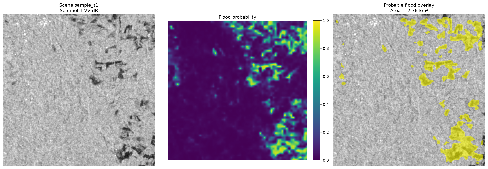
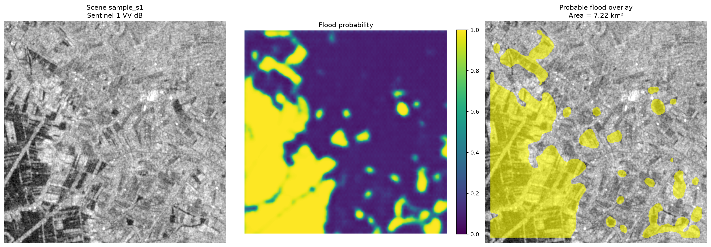
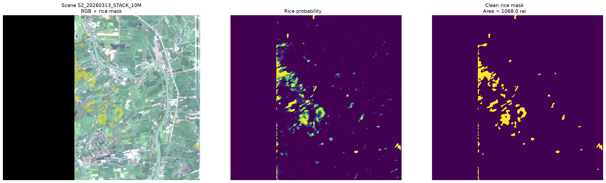

# geoint-insight

Free, lightweight geospatial AI toolkit, provided by
[GEOINT Insight](https://geoint-insight.com/foundation/). Organized by
capability area, each with one subpackage per model sharing a consistent
`predict_scene()` / `predict_folder()` API.

- [Flood Detection](#flood-detection) — available now
- [Rice Classification](#rice-classification) — available now
- Building Detection — coming soon
- Road Detection — coming soon

## Install

```bash
git clone https://github.com/geointinsight/foundation-model.git
cd foundation-model
pip install -e .
geoint-insight setup
```

This installs the `geoint_insight` Python package and a `geoint-insight` CLI
command, then downloads the model checkpoints into `./checkpoints/`. Model
weights aren't stored in the repo itself (too large for git) — `geoint-insight
setup` fetches them from GEOINT Insight's shared storage on demand and skips
re-downloading if they're already present. Sample input scenes (small, real)
are bundled directly in the package, so `--sample` works right after `setup`
completes.

A plain `requirements.txt` is also provided if you'd rather manage
dependencies without installing the package itself — see each capability area
below for what's included in the base install vs. optional extras.

---

## Flood Detection

Predicts probable flood extent from satellite imagery. Two models:

- **`sar`** — Sentinel-1 SAR only (Sen1Floods11 baseline, FCN-ResNet50).
  No Sentinel-2 imagery required.
- **`multisensor`** — Sentinel-1 + Sentinel-2 dual-modality (TerraMind
  foundation model). Both bands are required; needs the optional
  `multisensor` extra.

Each model is a lightweight subset of a larger internal pipeline. Not
included here:

- **Test-time augmentation** (averaging predictions over flipped/rotated views)
- **Adaptive spatial thresholding** (smoothly-varying threshold across one large scene)
- **Grid-mosaic support** — sharing one threshold and cleaning connected flood
  components across a whole grid of adjacent tiles. Without this, tiling a
  large area into a grid and mosaicking the results afterward may show slightly
  inconsistent flood extent right at tile boundaries.

Every scene is predicted independently, with a straightforward
prepare → infer → threshold → clean → export pipeline.

**Example output** (bundled `--sample` scenes — Sentinel-1 VV / flood
probability / probable-flood overlay):

`sar` (Sentinel-1 only, 2.76 km² detected):



`multisensor` (Sentinel-1 + Sentinel-2, 7.22 km² detected):



### Setup

`geoint-insight setup` (see Install above) downloads both checkpoints into
`./checkpoints/`:

- `sar_geoint_insight.cp` — Sen1Floods11 baseline (FCN-ResNet50)
- `multisensor_geoint_insight.ckpt` — TerraMind (S1+S2)

A small real Sentinel-1 sample scene (for `sar`) and a real S1+S2 sample pair
(for `multisensor`) are bundled directly in the package, so `--sample` works
for both models as soon as `setup` finishes — no separate data download
needed.

`multisensor` additionally needs the optional extra installed (terratorch is
a much larger dependency, so it's not part of the base install):

```bash
pip install -e ".[multisensor]"
```

### Quickstart

```bash
geoint-insight sar --sample --output-dir outputs/
geoint-insight multisensor --sample --output-dir outputs/   # needs the multisensor extra + its checkpoint, see above
```

Runs a bundled real sample scene end to end and writes results under
`outputs/outputs/` (probability raster, mask, polygon, preview PNG — see
Output below).

### CLI

Every model is a required subcommand — there's no default model, since
different models expect different inputs.

```bash
geoint-insight sar --s1 path/to/S1.tif --output-dir outputs/
geoint-insight sar --s1 scene1.tif --s1 scene2.tif --device cpu
geoint-insight sar --s1 scene.tif --threshold 0.6 --no-auto-threshold

geoint-insight multisensor --s1 path/to/S1.tif --s2 path/to/S2.tif --output-dir outputs/
geoint-insight multisensor --sample --output-dir outputs/
```

Run `geoint-insight --help`, `geoint-insight sar --help`, or
`geoint-insight multisensor --help` for the full flag list.

### Python API

Either import a model's subpackage directly, or use the unified `predict()`,
which always requires naming the model explicitly:

```python
from geoint_insight.sar import predict_scene, predict_folder, sample_path

result = predict_scene(sample_path(), "outputs/")   # bundled sample, zero setup
print(result.flood_area_km2, result.threshold, result.polygon_path)

result = predict_scene("path/to/S1.tif", "outputs/")

# Batch over a folder, reusing one loaded model:
results = predict_folder("scenes/", "outputs/", pattern="*.tif")
```

```python
from geoint_insight.multisensor import predict_scene, sample_s1_path, sample_s2_path

result = predict_scene(sample_s1_path(), sample_s2_path(), "outputs/")   # bundled sample, zero setup
result = predict_scene("path/to/S1.tif", "path/to/S2.tif", "outputs/")
```

```python
from geoint_insight import predict

result = predict(model="sar", s1_path="path/to/S1.tif", output_dir="outputs/")
result = predict(model="multisensor", s1_path="path/to/S1.tif", s2_path="path/to/S2.tif", output_dir="outputs/")
```

`s1_path` must be a 1- or 2-band Sentinel-1 GeoTIFF (VV, or VV+VH). A single
band is treated as VV and VH is approximated from Sen1Floods11 training
statistics — expect lower accuracy than genuine VV+VH input. `s2_path` (for
`multisensor`) must be a 3-, 4-, or 13-band Sentinel-2 GeoTIFF — anything
short of the full 13 L1C bands is filled in with training-set band means and
should be treated as prototype quality.

### Output

Per scene, under `<output_dir>/outputs/`:

- `01_flood_probability.tif` — per-pixel flood probability (float32, NaN = no data)
- `02_flood_mask_raw.tif` / `03_flood_mask_clean.tif` — thresholded masks before/after cleanup
- `04_probable_flood_polygons.gpkg` — vectorized flood extent
- `05_flood_prediction_preview.png` — 3-panel preview (SAR / probability / overlay)

Results are a **probable flood extent prototype**, not a validated flood
product — SAR alone cannot always distinguish real floodwater from other flat,
wet, or smooth surfaces (wet soil, freshly-plowed fields, etc).

---

## Rice Classification

Predicts rice extent from a **multitemporal stack** of Sentinel-2 scenes (one
GeoTIFF per acquisition date, all on the same grid) using a TerraMind
checkpoint fine-tuned per dataset.

Unlike `sar`/`multisensor`, a rice checkpoint isn't one portable file — it's a
directory of three files that must ship together:

```text
<model_dir>/
├── best.ckpt                  (or last.ckpt / *rice*iou*.ckpt)
├── training_config.json       # timestamps, recommended probability threshold
└── normalization_stats.json   # band_names, means, stds
```

A small bundled sample (real Sentinel-2 crop, Prathumthanee, Thailand, 3
timestamps) lets `--sample`/`sample_stack_paths()` work right after Setup
below. Validated against the real fine-tuned checkpoint: detected rice extent
lines up closely with the visible paddy field boundaries in the source
imagery, both in the bundled sample and in larger real multi-date crops from
the same area.

**Example output** (bundled `--sample` scene — RGB + rice mask / probability /
clean mask, 1,068 rai / 1.71 km² detected):



Needs the optional `rice` extra (a different terratorch version than
`multisensor` — don't install both extras in one environment without checking
they still agree):

```bash
pip install -e ".[rice]"
```

### Setup

```bash
geoint-insight setup --rice
```

Downloads `rice_geoint_insight.ckpt` + `training_config.json` +
`normalization_stats.json` into `./checkpoints/rice/` (skipped by default
`geoint-insight setup` since it's a separate, larger, dataset-specific
checkpoint — see Rice Classification's own note on this above). You still
need to supply your own multitemporal Sentinel-2 stack — this only provides
the model.

### CLI

```bash
geoint-insight rice --sample --output-dir outputs/   # bundled 3-timestamp sample, zero setup beyond the checkpoint
geoint-insight rice --stacks 2026-03-13_STACK.tif 2026-03-26_STACK.tif --checkpoint path/to/model_dir --output-dir outputs/
geoint-insight rice --stack-dir stacks_10m/ --valid-mask-dir valid_masks_10m/ --checkpoint path/to/model_dir --output-dir outputs/
```

`--stacks` takes an explicit ordered list of per-date files. `--stack-dir`
instead auto-discovers stacks by a `YYYYMMDD` date in each filename (glob
`--stack-glob`, default `*STACK*.tif`), restricted to `--timestamps` if given,
else the checkpoint's own `training_config.json` timestamps, else every date
found. `--checkpoint` can be omitted once `geoint-insight setup --rice` has
run (auto-discovered from `./checkpoints/rice/`). Run `geoint-insight rice
--help` for the full flag list.

### Python API

```python
from geoint_insight.rice import load_model, predict_scene, predict_stacks_folder

model, device, config = load_model(checkpoint_path="path/to/model_dir")

result = predict_scene(
    ["2026-03-13_STACK.tif", "2026-03-26_STACK.tif"], "outputs/",
    model=model, device=device, config=config,
)

# Or auto-discover per-date stacks in a folder:
result = predict_stacks_folder("stacks_10m/", "outputs/", checkpoint_path="path/to/model_dir")

print(result.rice_area_rai, result.threshold, result.probability_path)
```

### Output

Per scene, under `<output_dir>/outputs/`:

- `01_rice_probability.tif` — per-pixel rice probability (float32, NaN = no data)
- `02_rice_mask_raw.tif` / `03_rice_mask_clean.tif` — thresholded masks
  before/after sieving out small objects (`--min-object-area-m2`)
- `04_rice_polygons.gpkg` — vectorized rice extent with `area_m2`/`area_rai`
  (only written with `--export-vector`; off by default since a full scene can
  produce a large number of polygons)
- `05_rice_prediction_preview.png` — downsampled RGB + probability + mask preview

Area is reported in both km² and *rai* (1 rai = 1,600 m², the standard Thai
land-area unit this model was built for).

### Running on a different area

Nothing in the code is hardcoded to one location — point `--stacks`/`--stack-dir`
at any other area's Sentinel-2 stack and it runs. A few things affect how well
it generalizes:

- **Bands**: still needs `B02/B03/B04/B8A/B11/B12` (or a 10+ band stack they
  can be resolved from) at 10 m resolution.
- **Normalization is region-specific**: `normalization_stats.json`'s
  means/stds were computed from the training area's own imagery (Prathumthanee,
  Thailand). Other Thai rice-growing areas with similar soil/crop conditions
  should still work reasonably; visually very different regions (different
  country, different crop, very different terrain) will likely see reduced
  accuracy since the input z-normalization no longer matches what the model
  saw in training — treat those as prototype results and check them visually
  before trusting them, same caveat as the flood models.
- **Timestamps should match local phenology**: the checkpoint was trained on
  6 dates spanning dry season through early wet season (land prep through
  active growth). A new area's growing calendar may differ — pick dates that
  cover a similar planting → growth → pre-harvest arc rather than matching
  the exact same calendar dates.

## Building Detection

Coming soon.

## Road Detection

Coming soon.

---

## Package layout (for adding a new model)

```
src/geoint_insight/
  __init__.py       top-level predict(model=..., ...) unified entry point
  _setup.py         `geoint-insight setup` — downloads checkpoints into ./checkpoints/
  _common/          shared helpers (geo/CRS, tiling, SAR dB conversion,
                    thresholding, mask cleanup, export) — model-agnostic
  sar/               S1-only flood model: preprocessing, model, inference, pipeline, CLI
  multisensor/       S1+S2 flood model: same shape as sar
  rice/              Multitemporal S2 rice model: same shape as sar, but a
                    checkpoint is a directory (see Rice Classification above)
                    and predict_scene() takes an ordered list of stack paths
    cli.py            add_subparser(subparsers) registers `geoint-insight multisensor ...`
  cli.py            top-level CLI dispatcher — new models register by adding
                    one line to _SUBCOMMAND_MODULES
```

A new model subpackage (flood detection or a future capability area) should
expose the same shape as `sar`/`multisensor`: `predict_scene()`,
`predict_folder()`, `load_model()`, a `SceneResult` dataclass, and a `cli.py`
with `add_subparser(subparsers)` — then register its package name in both
`geoint_insight/cli.py`'s `_SUBCOMMAND_MODULES` and
`geoint_insight/__init__.py`'s `AVAILABLE_MODELS` (the latter is what
`predict(model=...)` checks against). Put anything genuinely model-agnostic
(tiling, generic raster helpers, thresholding/cleaning/export) in `_common/`
rather than duplicating it per model.

## About

`geoint-insight` is provided free and open-source by
[GEOINT Insight](https://geoint-insight.com/foundation/). Licensed under MIT —
see [LICENSE](LICENSE).
